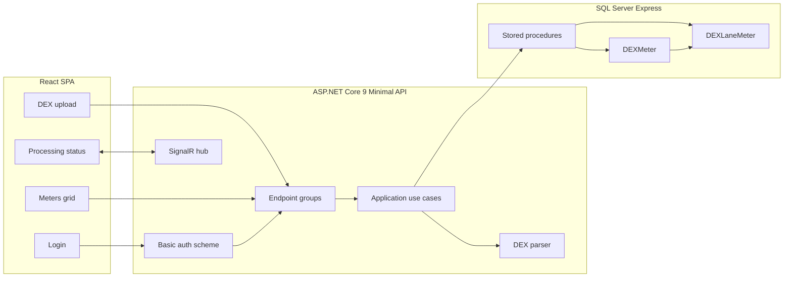
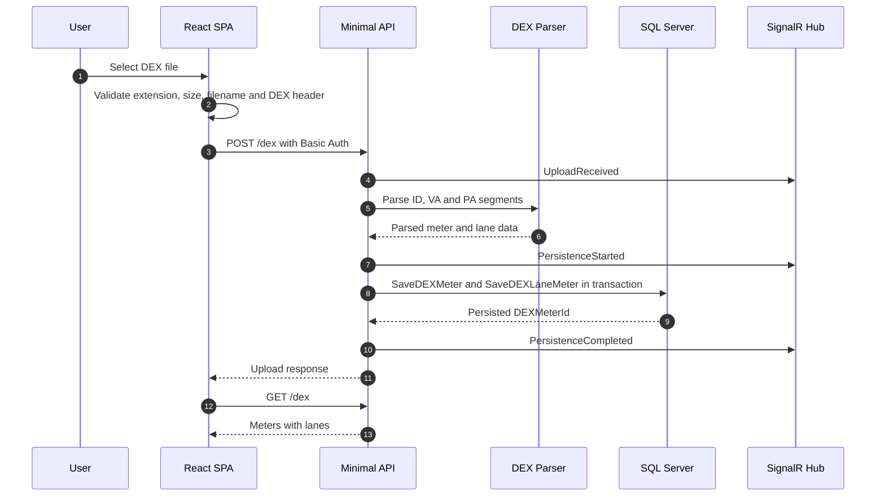

# Nayax / VendSys DEX Console

Full-stack application for processing NAMA DEX files. The app authenticates a user, uploads DEX files, parses ID/VA/PA segments, stores meter and lane data in SQL Server through stored procedures, and displays persisted DEX meters in a Syncfusion Grid.

## Stack

- ASP.NET Core 9 Minimal APIs
- SQL Server 2022 Express or LocalDB
- React SPA with Vite and TypeScript
- Syncfusion Grid
- SignalR processing status
- Docker Compose
- xUnit, FluentAssertions, Vitest, Testing Library, MSW

## Architecture



## Upload Processing Flow



## Test Credentials

```text
Username: vendsys
Password: NFsZGmHAGWJSZ#RuvdiV
```

## Run With Docker

Recommended path:

```bash
test -f .env || cp .env.example .env
docker compose up --build
```

Open:

- Frontend: http://localhost:3000
- Swagger: http://localhost:8080/swagger/
- Health: http://localhost:8080/health

Docker uses SQL Server Express (`MSSQL_PID=Express`) and applies the database scripts automatically on API startup.

## Run Without Docker

Prerequisites:

- .NET SDK 9
- Node.js 22+
- SQL Server Express, SQL Server Developer, or LocalDB

Windows PowerShell:

```powershell
.\scripts\start-local.ps1
```

Windows cmd:

```bat
scripts\start-local.bat
```

Linux/macOS:

```bash
./scripts/start-local.sh
```

The PowerShell script uses LocalDB automatically on Windows when available. The Linux/macOS script expects SQL Server on `localhost,1433`; override with `Persistence__ConnectionString` when needed:

```bash
Persistence__ConnectionString="Server=localhost,1433;Database=VendSysDex;User Id=sa;Password=YourStrong!Passw0rd;TrustServerCertificate=True;Encrypt=False" ./scripts/start-local.sh
```

Local dev URLs:

- Frontend: http://localhost:5173
- Swagger: http://localhost:8080/swagger/

## Manual Build And Test

Backend:

```bash
dotnet restore src/backend/NayaxVendSys.sln
dotnet build src/backend/NayaxVendSys.sln
dotnet test src/backend/NayaxVendSys.sln
```

Frontend:

```bash
cd src/frontend
npm install
npm run lint
npm test
npm run build
```

## API

- `POST /authenticate`
- `POST /dex`
- `GET /dex`
- `DELETE /dex`
- `GET /health`
- SignalR hub: `/hubs/dex-processing`

`POST /dex`, `GET /dex`, and `DELETE /dex` require HTTP Basic Authorization.

Example upload:

```bash
AUTH="$(printf 'vendsys:NFsZGmHAGWJSZ#RuvdiV' | base64 | tr -d '\n')"
curl -i http://localhost:8080/dex \
  -H "Authorization: Basic $AUTH" \
  -F "file=@samples/dex-machine-a.txt"
```

## Database

The schema has two main tables:

- `dbo.DEXMeter`
- `dbo.DEXLaneMeter`

Persistence uses:

- `dbo.SaveDEXMeter`
- `dbo.SaveDEXLaneMeter`
- `dbo.ClearDEXData`

`SaveDEXMeter` is idempotent for `(MachineId, DEXDateTime)`: uploading the same audit again updates the meter and recreates its lanes. Distinct machine/date reads remain historical rows.

## DEX Mapping

The project stores:

- `DEXMeter.MachineId`: sample machine identifier from `ID101`
- `DEXMeter.MachineSerialNumber`: `ID101`
- `DEXMeter.DEXDateTime`: `ID501` + `ID502` + `ID503`
- `DEXMeter.ValueOfPaidVends`: `VA101`
- `DEXLaneMeter.ProductIdentifier`: `PA101`
- `DEXLaneMeter.Price`: `PA102`
- `DEXLaneMeter.NumberOfVends`: `PA201`
- `DEXLaneMeter.ValueOfPaidSales`: `PA202`

The supplied DEX samples identify machines by the `ID101` values `100077238` and `302029479`, so those values are used as the persisted machine identifiers.

Currency fields use EVADTS implied decimal scaling. The samples define `ID401=2`, so `325` is stored as `3.25`.

## Backup

A real SQL Server backup is included at:

```text
database/backups/VendSysDex.bak
```

Regenerate after the stack is running:

```bash
scripts/backup-db.sh
```

Restore:

```bash
scripts/restore-db.sh database/backups/VendSysDex.bak
```
